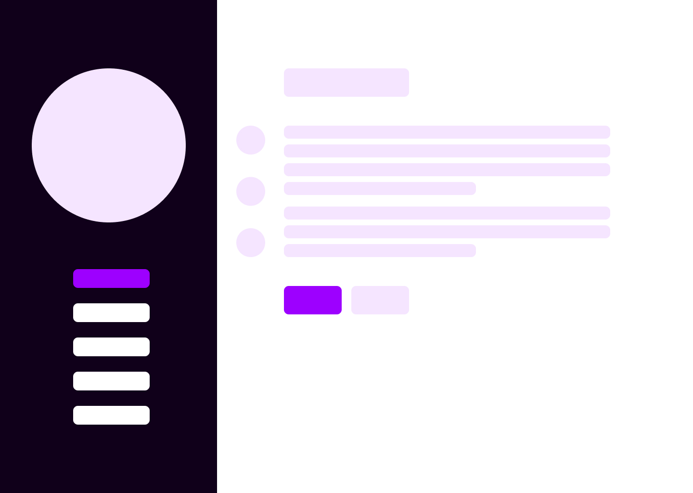

# Curriculum Vitae

I created this web application for personal use as a dynamic representation of my CV. Each page within the application corresponds to a distinct section, where I've made an effort to provide a clear and comprehensive depiction of various aspects of my life up to this point.

My application is live at this [link](https://www.dutaflavia.ro).



## Requirements
- Node.js [link](https://nodejs.org/en)

## Installation

To install the application locally on your computer open an empty folder and run those commands in the terminal:

```
    git clone https://github.com/flavia121duta/curriculum-vitae-main.git
    cd curriculum vitae
    npm i
    npm start
```

Open http://localhost:3000 to view it in your browser.